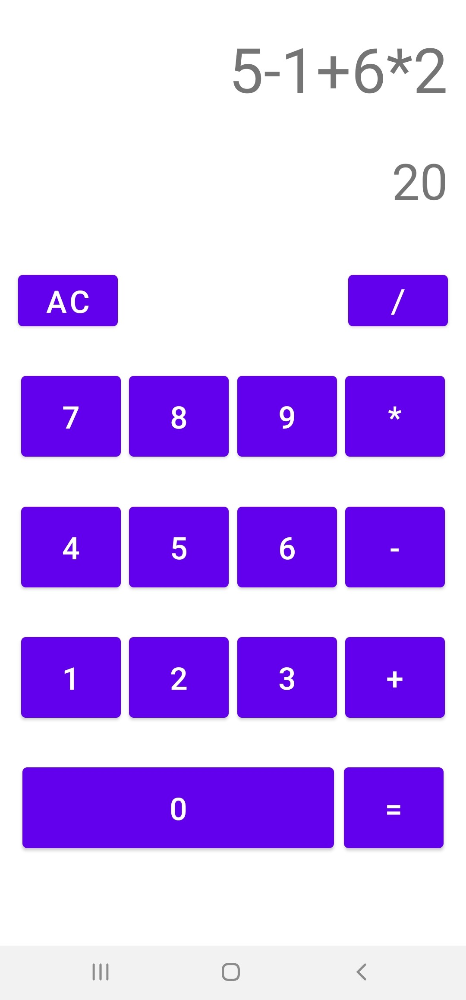

# Calculadora de números inteiros

Projeto desenvolvido com o objetivo de praticar a teoria ensinadas nos codelabs do curso Android Basics in Kotlin.  

## Utilização
---
Até o momento, somente é possível realizar as operações matemáticas básicas (adição, subtração, multiplicação e divisão) com números inteiros.

